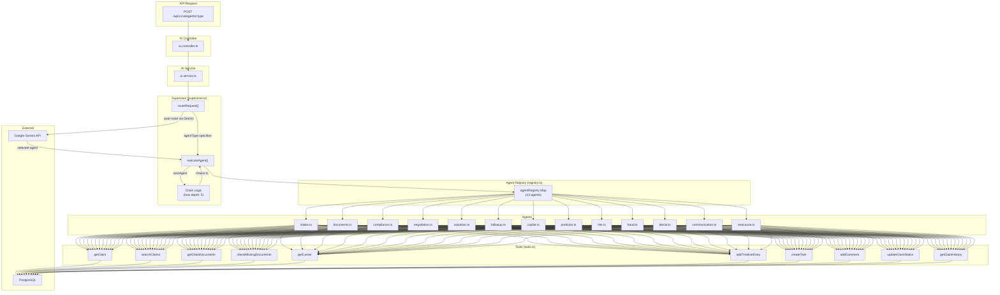
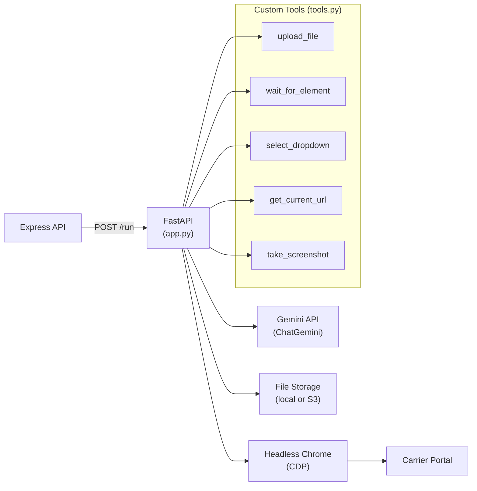

# AI Agents Guide

> Comprehensive guide to the FreightClaims v5 AI agent system.

---

## Table of Contents

- [System Overview](#system-overview)
- [Architecture](#architecture)
- [All 13 Agents](#all-13-agents)
- [Supervisor Routing Logic](#supervisor-routing-logic)
- [Tool Registry](#tool-registry)
- [Gemini Client](#gemini-client)
- [Python Browser Agent](#python-browser-agent)
- [Adding a New Agent](#adding-a-new-agent)
- [Agent Configuration](#agent-configuration)

---

## System Overview

The FreightClaims AI system is built on a **supervisor pattern** — a central orchestrator that routes user requests to specialized agents, each designed for a specific claims-management task.

Key design principles:

- **Single responsibility**: Each agent handles one domain (compliance, valuation, fraud, etc.)
- **Tool-based**: Agents interact with the database and claim data through a shared tool registry
- **Chainable**: Agents can delegate to other agents (e.g., Intake → Documents → Compliance)
- **LLM-powered**: All agents use Google Gemini for reasoning and generation
- **Observable**: Every agent run is logged to the `ai_agent_runs` table with input, output, duration, and status

The system lives in two places:

| Component | Location | Language |
|-----------|----------|----------|
| Supervisor, 13 agents, tool registry, Gemini client | `apps/api/src/services/agents/` | TypeScript |
| Browser automation agent | `apps/ai-agent/` | Python |

---

## Architecture



---

## All 13 Agents

### 1. Claim Intake Agent

| Property | Value |
|----------|-------|
| **Type** | `intake` |
| **Name** | Claim Intake Agent |
| **File** | `agents/intake.ts` |
| **Purpose** | Extract claim data from emails and documents. Classify document types. Detect potential duplicate claims. Auto-create claims from structured extracted data. |
| **Tools Used** | `getCarrier`, plus custom extraction logic |
| **Chains To** | `documents` (when confidence is low or docs are missing) |

**Input**: Raw email/document content, attached files, carrier SCAC code.

**Output**: Extracted claim fields (claimant, carrier, PRO number, amounts, dates, damage type), document classifications, confidence scores, duplicate warnings.

---

### 2. Missing Documents Agent

| Property | Value |
|----------|-------|
| **Type** | `documents` |
| **Name** | Missing Documents Agent |
| **File** | `agents/documents.ts` |
| **Purpose** | Identify which required documents are missing for a claim type. Draft follow-up emails requesting missing documents. Create tasks for the claims handler. |
| **Tools Used** | `getClaim`, `checkMissingDocuments`, `addComment`, `createTask` |
| **Chains To** | `compliance` (when all required documents are present) |

**Input**: Claim ID.

**Output**: List of missing documents, required-vs-uploaded comparison, drafted email templates, created tasks.

---

### 3. Legal Compliance Agent

| Property | Value |
|----------|-------|
| **Type** | `compliance` |
| **Name** | Legal Compliance Agent |
| **File** | `agents/compliance.ts` |
| **Purpose** | Check Carmack Amendment timelines and deadlines. Flag overdue filing windows. Generate compliance checklists. Calculate statute of limitations. |
| **Tools Used** | `getClaim`, `createTask`, `addComment` |

**Input**: Claim ID.

**Output**: Compliance status, deadline calculations (filing deadline, acknowledgment deadline, resolution deadline), flagged issues, regulatory references, recommended actions.

---

### 4. Carrier Negotiation Agent

| Property | Value |
|----------|-------|
| **Type** | `negotiation` |
| **Name** | Carrier Negotiation Agent |
| **File** | `agents/negotiation.ts` |
| **Purpose** | Generate denial rebuttals based on claim evidence. Develop settlement negotiation strategies. Reference historical settlement data for similar claims. |
| **Tools Used** | `getClaim`, `getClaimHistory`, `addComment`, `createTask` |

**Input**: Claim ID, denial details (if applicable).

**Output**: Rebuttal arguments, settlement strategy recommendations, comparable settlement references, negotiation talking points, recommended next steps.

---

### 5. Claim Valuation Agent

| Property | Value |
|----------|-------|
| **Type** | `valuation` |
| **Name** | Claim Valuation Agent |
| **File** | `agents/valuation.ts` |
| **Purpose** | Predict settlement amounts based on claim details and historical data. Evaluate claim strength. Recommend settlement strategy (accept, negotiate, litigate). |
| **Tools Used** | `getClaim`, `getClaimHistory`, `getCarrier`, `getClaimDocuments`, `addComment` |

**Input**: Claim ID.

**Output**: Estimated settlement range (min/max/likely), claim strength score, carrier payment history, documentation completeness assessment, strategy recommendation.

---

### 6. Status Follow-Up Agent

| Property | Value |
|----------|-------|
| **Type** | `followup` |
| **Name** | Status Follow-Up Agent |
| **File** | `agents/followup.ts` |
| **Purpose** | Identify stale claims needing attention. Generate follow-up communications. Escalate overdue claims. Schedule automatic reminders. |
| **Tools Used** | `getClaim`, `createTask`, `addComment` |

**Input**: Claim ID or filter criteria.

**Output**: Follow-up priority ranking, drafted follow-up emails, escalation recommendations, created tasks with due dates.

---

### 7. Customer Copilot Agent

| Property | Value |
|----------|-------|
| **Type** | `copilot` |
| **Name** | Customer Copilot Agent |
| **File** | `agents/copilot.ts` |
| **Purpose** | Conversational Q&A about claims, compliance, and processes. General-purpose assistant for claims handlers. Multi-turn conversation support. |
| **Tools Used** | None (queries Prisma directly for claim data) |

**Input**: User message, conversation history, optional claim context.

**Output**: Conversational response with relevant claim data, compliance guidance, or process explanations.

---

### 8. Claim Outcome Predictor

| Property | Value |
|----------|-------|
| **Type** | `predictor` |
| **Name** | Claim Outcome Predictor |
| **File** | `agents/predictor.ts` |
| **Purpose** | Predict claim outcomes (approved, denied, settled). Estimate resolution timeline. Identify factors affecting outcome probability. |
| **Tools Used** | `getClaim`, `getClaimHistory`, `checkMissingDocuments`, plus Prisma for historical patterns |

**Input**: Claim ID.

**Output**: Outcome probabilities (approve/deny/settle), estimated resolution days, key positive/negative factors, confidence score, recommendations to improve outcome.

---

### 9. Carrier Risk Scoring Agent

| Property | Value |
|----------|-------|
| **Type** | `risk` |
| **Name** | Carrier Risk Scoring Agent |
| **File** | `agents/risk.ts` |
| **Purpose** | Score carriers on reliability and claim handling. Analyze claim rates, denial rates, payment speed. Generate risk profiles. |
| **Tools Used** | None (queries Prisma directly for carrier and claim statistics) |

**Input**: Carrier ID or SCAC code.

**Output**: Overall risk score (0-100), component scores (claim rate, denial rate, payment speed, resolution time), historical trend, peer comparison, risk factors.

Writes results to the `carrier_risk_scores` table.

---

### 10. Anomaly & Fraud Detection Agent

| Property | Value |
|----------|-------|
| **Type** | `fraud` |
| **Name** | Anomaly & Fraud Detection Agent |
| **File** | `agents/fraud.ts` |
| **Purpose** | Detect potential duplicate claims. Flag amount anomalies. Identify suspicious timing patterns. Pattern matching across claim clusters. |
| **Tools Used** | `getClaim`, plus Prisma for cross-claim pattern analysis |

**Input**: Claim ID.

**Output**: Fraud flags with severity (low/medium/high/critical), evidence details, matched patterns, similar claims, recommended investigation steps.

Writes results to the `fraud_flags` table.

---

### 11. Smart Denial Response Generator

| Property | Value |
|----------|-------|
| **Type** | `denial` |
| **Name** | Smart Denial Response Generator |
| **File** | `agents/denial.ts` |
| **Purpose** | Analyze carrier denial reasons. Draft formal appeal letters. Generate rebuttals with legal references and supporting evidence. |
| **Tools Used** | `getClaim` |

**Input**: Claim ID, denial letter/reason.

**Output**: Denial analysis, categorized denial reasons, drafted appeal letter, legal precedent references, evidence summary, recommended attachments.

---

### 12. Automated Carrier Communication Agent

| Property | Value |
|----------|-------|
| **Type** | `communication` |
| **Name** | Automated Carrier Communication Agent |
| **File** | `agents/communication.ts` |
| **Purpose** | Draft professional carrier correspondence. Generate status inquiry letters. Create demand letters. Automate routine communications. |
| **Tools Used** | `getClaim`, plus Prisma for carrier contact information |

**Input**: Claim ID, communication type (inquiry, demand, follow-up, acknowledgment).

**Output**: Drafted communication with proper formatting, carrier contact details, recommended send method, follow-up schedule.

---

### 13. Predictive Root Cause Analysis Agent

| Property | Value |
|----------|-------|
| **Type** | `rootcause` |
| **Name** | Predictive Root Cause Analysis Agent |
| **File** | `agents/rootcause.ts` |
| **Purpose** | Analyze claim clusters to identify systemic issues. Identify common root causes (carrier, route, commodity, season). Generate preventive recommendations. |
| **Tools Used** | None (queries Prisma for aggregate claim data) |

**Input**: Filter criteria (date range, carrier, customer, claim type).

**Output**: Root cause categories with frequency, contributing factors, trend analysis, prevention recommendations, carrier-specific insights.

---

## Supervisor Routing Logic

The supervisor (`supervisor.ts`) orchestrates the entire agent system:

### Request Flow

```
1. Request arrives at supervisor.routeRequest()
2. If agentType is specified → dispatch directly to that agent
3. If agentType is NOT specified:
   a. Send request description + all agent descriptions to Gemini
   b. Gemini selects the best-fit agent
   c. Dispatch to selected agent
4. Agent executes and returns result
5. If result contains nextAgent → chain to next agent (up to MAX_CHAIN_DEPTH=5)
6. On routing failure → fallback to copilot agent
7. Log agent run to ai_agent_runs table
```

### Agent Chaining

Agents can trigger follow-up agents by including `nextAgent` in their response:

| Source Agent | Chains To | Condition |
|-------------|-----------|-----------|
| `intake` | `documents` | When extraction confidence is low or documents appear to be missing |
| `documents` | `compliance` | When all required documents are present and compliance check is needed |

Chaining is limited to **5 hops** to prevent infinite loops.

---

## Tool Registry

All tools are defined in `agents/tools.ts` and available to any agent via the supervisor.

### 1. `getClaim`

Retrieves a full claim with all relations.

```typescript
getClaim(claimId: string): Promise<Claim>
```

**Returns**: Claim with parties, products, documents (with categories), timeline, payments, comments, tasks.

### 2. `searchClaims`

Searches claims with filters.

```typescript
searchClaims(filters: {
  status?: string;
  customerId?: string;
  carrierScac?: string;
  claimType?: string;
  proNumber?: string;
}): Promise<Claim[]>
```

### 3. `getClaimDocuments`

Gets all documents for a claim with category information.

```typescript
getClaimDocuments(claimId: string): Promise<ClaimDocument[]>
```

### 4. `checkMissingDocuments`

Compares required documents (based on claim type) against uploaded documents.

```typescript
checkMissingDocuments(claimId: string): Promise<{
  required: DocumentCategory[];
  uploaded: ClaimDocument[];
  missing: DocumentCategory[];
}>
```

### 5. `getCarrier`

Looks up a carrier by SCAC code, including contacts and integrations.

```typescript
getCarrier(scacCode: string): Promise<Carrier>
```

### 6. `addTimelineEntry`

Adds a timeline entry to a claim's history.

```typescript
addTimelineEntry(params: {
  claimId: string;
  status: string;
  description: string;
  changedById: string;
}): Promise<ClaimTimeline>
```

### 7. `createTask`

Creates a task on a claim.

```typescript
createTask(params: {
  claimId: string;
  title: string;
  description?: string;
  priority: 'low' | 'medium' | 'high' | 'urgent';
  dueDate?: Date;
  assignedTo?: string;
  createdById: string;
}): Promise<ClaimTask>
```

### 8. `addComment`

Adds a comment to a claim.

```typescript
addComment(params: {
  claimId: string;
  userId: string;
  content: string;
  type: 'comment' | 'note' | 'system';
}): Promise<ClaimComment>
```

### 9. `updateClaimStatus`

Updates a claim's status and creates a corresponding timeline entry.

```typescript
updateClaimStatus(params: {
  claimId: string;
  status: string;
  changedById: string;
  description?: string;
}): Promise<Claim>
```

### 10. `getClaimHistory`

Retrieves historical settlement data for similar claims (by carrier, claim type, amount range).

```typescript
getClaimHistory(params: {
  carrierScac?: string;
  claimType?: string;
  amountRange?: { min: number; max: number };
}): Promise<{
  avgSettlement: number;
  medianSettlement: number;
  settlementRate: number;
  avgResolutionDays: number;
  claims: Claim[];
}>
```

---

## Gemini Client

The Gemini client (`agents/gemini-client.ts`) provides a unified interface for all LLM calls.

### Methods

| Method | Purpose |
|--------|---------|
| `generateContent(prompt, options)` | Single-turn text generation (used by most agents) |
| `chat(messages, options)` | Multi-turn conversation (used by copilot) |
| `generateJSON<T>(prompt, options)` | Structured JSON output with type safety |

### Configuration

```typescript
{
  model: process.env.AI_MODEL || 'gemini-1.5-flash',
  apiKey: process.env.GEMINI_API_KEY,
  baseUrl: 'https://generativelanguage.googleapis.com/v1beta',
  defaults: {
    temperature: 0.7,
    maxOutputTokens: 4096,
  }
}
```

### Options

```typescript
interface GeminiOptions {
  temperature?: number;      // 0.0 - 1.0 (default: 0.7)
  maxOutputTokens?: number;  // Max response length (default: 4096)
  topP?: number;             // Nucleus sampling
  topK?: number;             // Top-K sampling
  retries?: number;          // Retry on 5xx errors
}
```

### Error Handling

The client automatically retries on 5xx errors (server-side Gemini failures) with exponential backoff. 4xx errors (bad request, quota exceeded) are thrown immediately.

---

## Python Browser Agent

The Python browser agent (`apps/ai-agent/`) is a standalone FastAPI service that automates carrier portal interactions using a real browser.

### Architecture



### Endpoint

**`POST /run`**

```json
{
  "auth": {
    "username": "portal_user",
    "password": "portal_pass"
  },
  "scacCode": "SEFL",
  "data": {
    "claimNumber": "CLM-2025-001",
    "proNumber": "123456789",
    "claimAmount": 5000.00,
    "documents": ["s3://bucket/doc1.pdf", "s3://bucket/doc2.jpg"]
  }
}
```

### How It Works

1. Receives a request with carrier auth credentials, SCAC code, and claim data
2. Downloads carrier-specific prompts from file storage (instructions for navigating that carrier's portal)
3. Downloads claim documents from file storage
4. Launches headless Chrome via CDP
5. Uses the `browser-use` library with Gemini as the LLM to navigate the carrier portal
6. Custom tools (Playwright-based) handle file uploads, dropdowns, and waits
7. Returns results (success/failure, screenshots, confirmation numbers)

### Custom Browser Tools

| Tool | Purpose |
|------|---------|
| `upload_file(selector, file_path)` | Upload a file to a file input element |
| `wait_for_element(selector, timeout)` | Wait for an element to appear on the page |
| `select_dropdown(selector, value)` | Select a value from a dropdown/select element |
| `get_current_url()` | Get the current page URL |
| `take_screenshot(path)` | Take a screenshot of the current page state |

### Health Check

**`GET /healthz`** — Returns 200 if the service is running.

---

## Adding a New Agent

Follow these steps to add a new agent to the system.

### Step 1: Create the Agent File

Create `apps/api/src/services/agents/my-agent.ts`:

```typescript
import { PrismaClient } from '@prisma/client';
import { geminiClient } from './gemini-client';
import { executeTool } from './tools';

const prisma = new PrismaClient();

interface MyAgentInput {
  claimId: string;
  userId: string;
  context?: Record<string, unknown>;
}

interface MyAgentOutput {
  analysis: string;
  recommendations: string[];
  confidence: number;
  nextAgent?: string;
}

export async function runMyAgent(input: MyAgentInput): Promise<MyAgentOutput> {
  const claim = await executeTool('getClaim', { claimId: input.claimId });

  const prompt = `
    You are the My Agent for FreightClaims.
    Analyze the following claim and provide your assessment.

    Claim: ${JSON.stringify(claim)}

    Respond in JSON format with:
    - analysis: string (your analysis)
    - recommendations: string[] (action items)
    - confidence: number (0-1)
  `;

  const result = await geminiClient.generateJSON<MyAgentOutput>(prompt, {
    temperature: 0.3,
  });

  await executeTool('addComment', {
    claimId: input.claimId,
    userId: input.userId,
    content: `[AI - My Agent] ${result.analysis}`,
    type: 'system',
  });

  return result;
}
```

### Step 2: Register the Agent

Add your agent to `apps/api/src/services/agents/registry.ts`:

```typescript
agentRegistry.set('my-agent', {
  type: 'my-agent',
  name: 'My Custom Agent',
  description: 'Describe what this agent does so the supervisor can route to it',
  run: runMyAgent,
});
```

### Step 3: Add the Route

Add a route in `apps/api/src/routes/ai.routes.ts`:

```typescript
router.post('/agents/my-agent', authenticate, async (req, res, next) => {
  try {
    const result = await aiService.runAgent('my-agent', req.body, req.user);
    res.json({ success: true, data: result });
  } catch (error) {
    next(error);
  }
});
```

### Step 4: Test

```bash
curl -X POST http://localhost:4000/api/v1/ai/agents/my-agent \
  -H "Authorization: Bearer <token>" \
  -H "Content-Type: application/json" \
  -d '{"claimId": "uuid-here"}'
```

---

## Agent Configuration

### Environment Variables

| Variable | Description | Default |
|----------|-------------|---------|
| `GEMINI_API_KEY` | Google Gemini API key (required) | — |
| `AI_MODEL` | Gemini model to use | `gemini-1.5-flash` |
| `AI_AGENT_URL` | Python browser agent URL | `http://localhost:8000` |
| `AI_MAX_CHAIN_DEPTH` | Maximum agent chaining depth | `5` |
| `AI_DEFAULT_TEMPERATURE` | Default Gemini temperature | `0.7` |
| `AI_MAX_OUTPUT_TOKENS` | Default max output tokens | `4096` |

### Python Browser Agent Variables

Set in `apps/ai-agent/.env`:

| Variable | Description |
|----------|-------------|
| `GEMINI_API_KEY` | Google Gemini API key |
| `API_BASE_URL` | URL of the main API service |
| `CHROME_CDP_URL` | Chrome DevTools Protocol URL (for headless Chrome) |
| `PORT` | FastAPI port (default: 8000) |

> **Note:** The AI agent service accesses documents through the main API, not directly from S3. AWS credentials are only needed if accessing S3 directly for prompt templates.

### Logging & Monitoring

Every agent run is logged to the `ai_agent_runs` table:

```sql
SELECT agent_type, status, duration, created_at
FROM ai_agent_runs
ORDER BY created_at DESC
LIMIT 20;
```

Fields: `agentType`, `input` (JSON), `output` (JSON), `status` (running/completed/failed), `duration` (ms), `userId`, `createdAt`.
