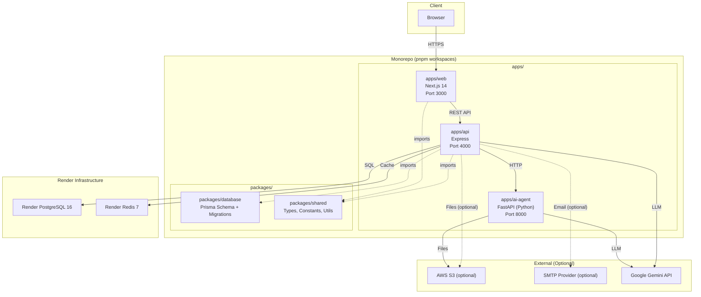
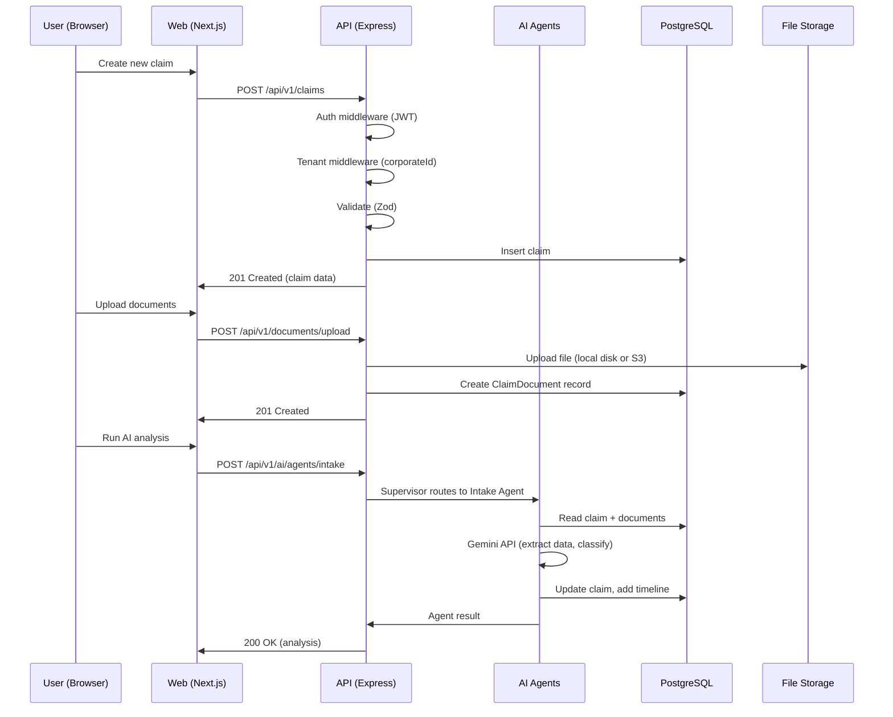
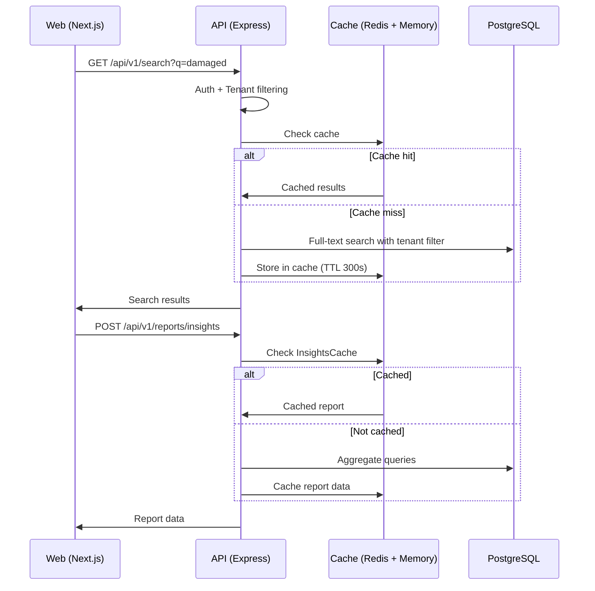
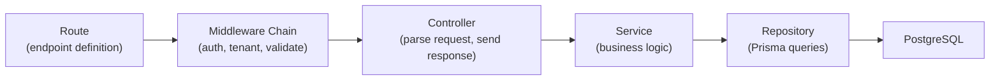
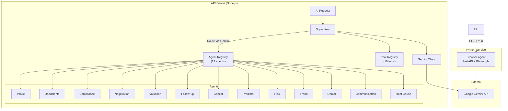
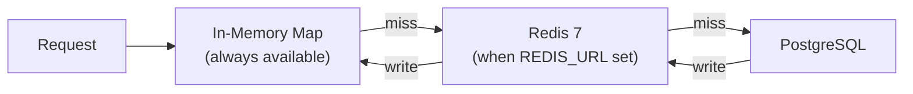
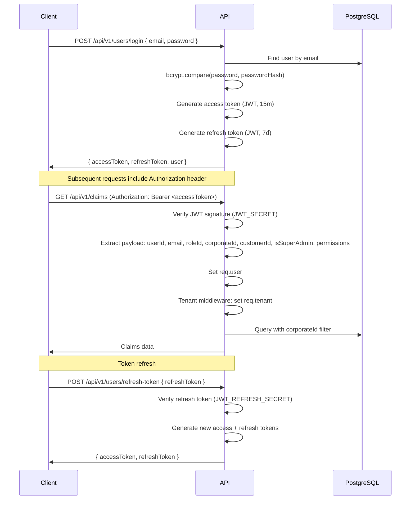
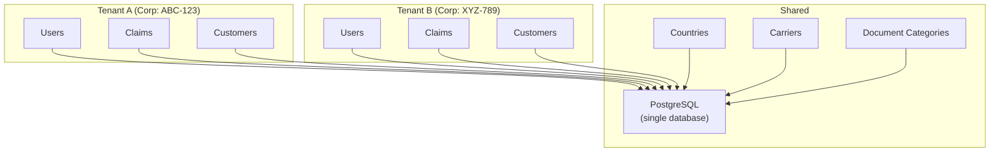

# Architecture Overview

> System architecture and design decisions for FreightClaims v5.

---

## Table of Contents

- [System Overview](#system-overview)
- [Monorepo Structure](#monorepo-structure)
- [Data Flow](#data-flow)
- [API Architecture](#api-architecture)
- [Frontend Architecture](#frontend-architecture)
- [AI Agent Architecture](#ai-agent-architecture)
- [Caching Strategy](#caching-strategy)
- [Authentication Flow](#authentication-flow)
- [Multi-Tenancy](#multi-tenancy)

---

## System Overview

FreightClaims v5 is a monorepo-based freight claims management platform built with pnpm workspaces. The system comprises three application services and two shared packages:



---

## Monorepo Structure

```
freightclaims-v5/
├── apps/
│   ├── api/                 # Express REST API (TypeScript)
│   │   └── src/
│   │       ├── config/      # Environment, constants
│   │       ├── controllers/ # Request handlers
│   │       ├── middleware/   # Auth, tenant, validation, rate-limit, audit
│   │       ├── repositories/# Data access layer (Prisma queries)
│   │       ├── routes/      # 15 route modules
│   │       ├── services/    # Business logic + AI agents
│   │       │   └── agents/  # 13 AI agents, supervisor, tools, Gemini client
│   │       ├── utils/       # Cache, helpers
│   │       ├── validators/  # Zod schemas
│   │       └── types/       # TypeScript interfaces
│   │
│   ├── web/                 # Next.js 14 frontend (TypeScript)
│   │   ├── app/             # App Router (route groups, pages, layouts)
│   │   ├── components/      # Reusable UI components
│   │   ├── hooks/           # Custom hooks (auth, queries)
│   │   └── lib/             # Utilities, API client
│   │
│   └── ai-agent/            # Python browser automation agent
│       ├── app.py           # FastAPI entry point
│       ├── tools.py         # Playwright browser tools
│       └── requirements.txt
│
├── packages/
│   ├── database/            # Prisma schema, migrations, seed
│   │   └── prisma/
│   │       ├── schema.prisma
│   │       └── seed.ts
│   │
│   └── shared/              # Shared TypeScript types, constants, utils
│       └── src/
│           ├── types/
│           ├── constants/
│           └── utils/
│
├── local-dev/               # Docker Compose for local services
│   ├── docker-compose.yml
│   └── .env.local
│
├── docs/                    # Documentation
├── package.json             # Root workspace config
├── pnpm-workspace.yaml      # Workspace definition
├── tsconfig.base.json       # Shared TypeScript config
├── eslint.config.mjs        # Shared ESLint flat config
└── .prettierrc              # Shared Prettier config
```

---

## Data Flow

### Claim Lifecycle



### Search & Reporting Flow



---

## API Architecture

### Tech Stack

| Layer | Technology |
|-------|-----------|
| Runtime | Node.js 20+ |
| Framework | Express |
| Language | TypeScript (CommonJS output) |
| Validation | Zod |
| ORM | Prisma |
| Auth | JWT (jsonwebtoken) + bcryptjs |
| Logging | Pino |
| File storage | Local disk (default) or AWS S3 (@aws-sdk/client-s3) |
| Email | Any SMTP provider (SendGrid, Mailgun, SES, etc.) |
| AI | Google Gemini (REST client) |
| Rate limiting | express-rate-limit |

### Controller / Service / Repository Pattern



**Routes** — Define HTTP method + path, attach middleware, delegate to controllers.

**Middleware chain** — Runs in order for each request:

1. `helmet` — Security headers
2. `cors` — Cross-origin configuration
3. `compression` — Gzip response compression
4. `pino-http` — Request logging
5. `express.json()` — Body parsing
6. `rate-limiter` — Rate limiting (per-route configurable)
7. `authenticate` — JWT verification, sets `req.user`
8. `tenantMiddleware` — Sets `req.tenant` with `corporateId`
9. `authorize(roles)` — Role-based access check
10. `validate(schema)` — Zod request body/query validation
11. `auditMiddleware` — Activity logging

**Controllers** — Extract validated data from `req`, call service methods, format HTTP response.

**Services** — Core business logic. Services may call multiple repositories, integrate with AI agents, or invoke external services (storage, email, Gemini).

**Repositories** — Thin Prisma query wrappers. Every query includes `corporateId` filtering via the `tenantFilter()` helper to enforce multi-tenancy.

### Route Modules

The API mounts 15 route modules under `/api/v1`:

| Module | Mount Path | Routes |
|--------|-----------|--------|
| Claims | `/claims` | 32 endpoints — CRUD, status, parties, products, comments, tasks, payments, identifiers, dashboard, mass-upload, settings, acknowledgement |
| Users | `/users` | 26 endpoints — Auth (login, register, refresh, password reset), profile, CRUD, roles, permissions, templates |
| Customers | `/customers` | 17 endpoints — CRUD, contacts, addresses, notes, reports, country/address lookup |
| Shipments | `/shipments` | 24 endpoints — CRUD, contacts, carriers, carrier integrations, insurance, suppliers, mass-upload |
| Documents | `/documents` | 13 endpoints — List, upload, download, signed URL, categories, AI processing |
| Email | `/email` | 8 endpoints — Send, claim emails, notifications, preferences, queue processing |
| Search | `/search` | 5 endpoints — Universal, claims, customers, carriers, shipments |
| Reports | `/reports` | 8 endpoints — Insights, top customers/carriers, collection %, metrics, write-offs, export |
| Automation | `/automation` | 11 endpoints — Rules CRUD, templates CRUD, trigger |
| AI | `/ai` | 18 endpoints — 12 agent endpoints, copilot chat, conversations, status, history |
| Email Submission | `/email-submission` | 9 endpoints — Config, domains, senders, validation |
| Contracts | `/contracts` | 14 endpoints — Contracts CRUD, insurance certificates, tariffs, release values |
| News | `/news` | 11 endpoints — Public posts/categories, subscribe/unsubscribe, admin CRUD |
| Onboarding | `/onboarding` | 5 endpoints — Get/update state, complete step, dismiss tour, reset |
| Chatbot | `/chatbot` | 3 endpoints — Message, conversation history, resolve |

---

## Frontend Architecture

### Tech Stack

| Layer | Technology |
|-------|-----------|
| Framework | Next.js 14 (App Router) |
| Language | TypeScript |
| Styling | Tailwind CSS + clsx/tailwind-merge |
| State management | Zustand |
| Server state | TanStack Query v5 |
| Forms | React Hook Form + Zod |
| UI | Lucide icons, Recharts, Framer Motion, Sonner (toasts) |
| Theming | next-themes (light/dark) |
| HTTP client | Axios |

### Route Groups

The App Router uses route groups to separate concerns:

```
app/
├── (auth)/                    # Unauthenticated routes
│   ├── login/
│   ├── register/
│   ├── forgot-password/
│   └── reset-password/
│
├── (dashboard)/               # Authenticated application
│   ├── layout.tsx             # Sidebar, header, copilot, chatbot, onboarding
│   ├── claims/                # Claims list, new, detail, email, file
│   ├── customers/             # Customer management
│   ├── shipments/
│   ├── documents/
│   ├── reports/
│   ├── automation/
│   ├── ai/                    # AI agents interface
│   ├── contracts/
│   ├── tasks/
│   ├── mass-upload/
│   ├── settings/              # Profile, roles, templates, news, API, users
│   ├── onboarding/
│   └── help/
│
├── news/                      # Public news/blog
├── about/
├── features/
├── support/
├── terms/
├── privacy/
├── blog/
├── book-demo/
├── contact/
├── claim-assistance/
└── acknowledgement/[token]/   # Token-based claim acknowledgement
```

### State Management

**Zustand** — Client-side global state (auth only):

```typescript
// hooks/use-auth.ts
interface AuthState {
  user: User | null;
  isAuthenticated: boolean;
  isLoading: boolean;
  login(email: string, password: string): Promise<void>;
  register(data: RegisterData): Promise<void>;
  logout(): void;
  loadUser(): Promise<void>;
  hasPermission(permission: string): boolean;
  canEdit(module: string): boolean;
}
```

**TanStack Query v5** — Server state management:

```typescript
// components/providers/query-provider.tsx
const queryClient = new QueryClient({
  defaultOptions: {
    queries: {
      staleTime: 60 * 1000, // 1 minute
    },
  },
});
```

Used throughout dashboard pages for claims, customers, reports, settings, etc. Provides:
- Automatic caching and background refetching
- Optimistic updates for mutations
- Pagination support
- Query invalidation after mutations

---

## AI Agent Architecture

### Supervisor Pattern

The AI system uses a **supervisor pattern** where a central orchestrator routes requests to specialized agents:



### Agent Routing

1. If the request specifies an `agentType`, the supervisor dispatches directly.
2. Otherwise, the supervisor sends the request to Gemini with all agent descriptions from the registry, and Gemini selects the best agent.
3. Agents can chain to other agents by returning a `nextAgent` field (max depth: 5). For example, `intake` chains to `documents` when confidence is low, and `documents` chains to `compliance` when all documents are present.
4. On routing failure, the supervisor falls back to the `copilot` agent.

### Python Browser Agent

A separate FastAPI service (`apps/ai-agent`) handles browser-based carrier portal automation:

- Connects to headless Chrome via CDP
- Uses Playwright for browser control
- Accepts `POST /run` with auth credentials, SCAC code, and claim data
- Downloads carrier-specific prompts from S3
- Custom tools: `upload_file`, `wait_for_element`, `select_dropdown`, `get_current_url`, `take_screenshot`

See [AI_AGENTS_GUIDE.md](./AI_AGENTS_GUIDE.md) for full agent documentation.

---

## Caching Strategy

### Two-Tier Cache

The API uses a two-tier caching strategy defined in `utils/cache.ts`:



| Tier | Latency | Capacity | TTL | Availability |
|------|---------|----------|-----|-------------|
| **Memory** | ~0ms | Limited by Node heap | Per-key (default 300s) | Always |
| **Redis** | ~1ms | 128MB (configurable) | Per-key (default 300s) | Optional (fallback to memory-only) |

### Cache Operations

| Function | Behavior |
|----------|----------|
| `cacheGet<T>(key)` | Check memory first, then Redis. Promotes Redis hits to memory. |
| `cacheSet(key, value, ttl)` | Write to both memory and Redis (default 300s TTL). |
| `cacheDel(key)` | Delete from both tiers. |
| `cacheInvalidate(prefix)` | Delete all keys matching a prefix from both tiers. |

A background cleanup job runs every 60 seconds to evict expired entries from the in-memory store.

### What Gets Cached

- Carrier lookups (by SCAC code)
- Report/insights aggregations
- Session-related data
- Search results

---

## Authentication Flow

### JWT-Based Authentication



### JWT Payload

```typescript
interface JwtPayload {
  userId: string;
  email: string;
  roleId: string;
  corporateId: string | null;
  customerId: string | null;
  isSuperAdmin: boolean;
  permissions: string[];
}
```

### Role-Based Access Control (RBAC)

The `authorize(allowedRoles)` middleware restricts endpoints to specific roles:

| Role | Scope | Key Capabilities |
|------|-------|-----------------|
| **Super Admin** | Global | All permissions, all claims, cross-tenant access |
| **Admin** | Tenant | All permissions, all claims within tenant |
| **Manager** | Tenant | Full CRUD on claims, customers, shipments, reports, email, automation |
| **Claims Handler** | Tenant | CRUD claims, upload docs, basic reporting, AI copilot |
| **Viewer** | Tenant | Read-only access to claims, docs, customers, shipments, reports |

Permissions are granular (e.g., `claims.view`, `claims.edit`, `documents.upload`) and checked via the `permissions.middleware.ts`.

---

## Multi-Tenancy

### Design: `corporateId` on Every Model

FreightClaims v5 uses a **shared database, shared schema** multi-tenancy model. Tenant isolation is achieved by a `corporateId` column on virtually every data model:



### Tenant Middleware

The `tenant.middleware.ts` runs after authentication on every protected route:

1. Reads `corporateId` and `isSuperAdmin` from the JWT payload.
2. Sets `req.tenant` with:
   - `corporateId` — The user's home tenant
   - `isSuperAdmin` — Whether the user can cross tenants
   - `effectiveCorporateId` — The active tenant (may differ for super admins)
3. **Super Admin impersonation**: Super admins can pass `X-Corporate-Id` header to operate within a specific tenant's data.

### Tenant Filtering

The `tenantFilter(req)` helper generates a Prisma `where` clause:

```typescript
function tenantFilter(req: AuthenticatedRequest) {
  if (req.tenant.isSuperAdmin && !req.tenant.effectiveCorporateId) {
    return {};  // No filter — sees all data
  }
  return { corporateId: req.tenant.effectiveCorporateId };
}
```

Every repository query includes this filter, ensuring tenants never see each other's data.

### Models with `corporateId`

Claims, Users, Customers, Shipments, Roles, Automation Rules, Automation Templates, Contracts, Insurance Certificates, Email Submission Configs, Activity Logs — all have `corporateId` indexed for efficient tenant-scoped queries.

### Shared (Global) Models

Some models are tenant-agnostic and shared across all tenants:

- **Carriers** — Global carrier directory
- **Countries** — Country reference data
- **Document Categories** — Standard document types
- **Permissions** — System-wide permission definitions
- **News Posts** — Public content
