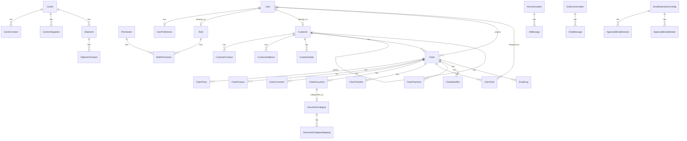

# Database Schema

> Complete database schema reference for FreightClaims v5.

---

## Table of Contents

- [Overview](#overview)
- [Users & Authentication](#users--authentication)
- [Customers & Companies](#customers--companies)
- [Claims](#claims)
- [Documents & Categories](#documents--categories)
- [Shipments](#shipments)
- [Carriers](#carriers)
- [Insurance & Suppliers](#insurance--suppliers)
- [Email & Notifications](#email--notifications)
- [AI & Automation](#ai--automation)
- [Email Submission](#email-submission)
- [Analytics & Reporting](#analytics--reporting)
- [Contracts & Insurance Certificates](#contracts--insurance-certificates)
- [Carrier Risk & Fraud](#carrier-risk--fraud)
- [Claim Archives & Duplicates](#claim-archives--duplicates)
- [Chatbot](#chatbot)
- [News & Newsletter](#news--newsletter)
- [Onboarding](#onboarding)
- [AI Predictions](#ai-predictions)
- [Key Relationships](#key-relationships)
- [Multi-Tenancy](#multi-tenancy)
- [Migration Workflow](#migration-workflow)
- [Seeding](#seeding)

---

## Overview

- **Database**: PostgreSQL 16
- **ORM**: Prisma (`packages/database/prisma/schema.prisma`)
- **Schema file**: `packages/database/prisma/schema.prisma`
- **Total models**: 45+
- **Multi-tenancy**: `corporateId` column on tenant-scoped models
- **Soft deletes**: `deletedAt` nullable timestamp on key entities
- **Audit timestamps**: `createdAt` + `updatedAt` on all mutable models
- **IDs**: UUID (`@default(uuid())`) on all primary keys

---

## Users & Authentication

### User

Primary user account. Linked to a role, optionally to a customer and corporate tenant.

| Column | Type | Notes |
|--------|------|-------|
| `id` | UUID | PK |
| `email` | String | Unique |
| `password_hash` | String | bcrypt hash |
| `first_name` | String | |
| `last_name` | String | |
| `phone` | String? | |
| `role_id` | UUID? | FK → Role |
| `corporate_id` | UUID? | FK → Customer (tenant) |
| `customer_id` | UUID? | FK → Customer |
| `is_active` | Boolean | Default: true |
| `is_super_admin` | Boolean | Default: false |
| `last_login_at` | DateTime? | |
| `reset_token` | String? | Password reset token |
| `reset_token_expires_at` | DateTime? | Token expiry |
| `created_at` | DateTime | |
| `updated_at` | DateTime | |
| `deleted_at` | DateTime? | Soft delete |

**Indexes**: `corporate_id`, `email`

### UserPreference

Per-user settings (notifications, theme, timezone).

| Column | Type | Notes |
|--------|------|-------|
| `id` | UUID | PK |
| `user_id` | UUID | Unique, FK → User |
| `email_notifications` | Boolean | Default: true |
| `push_notifications` | Boolean | Default: true |
| `daily_digest` | Boolean | Default: false |
| `theme` | String | Default: "light" |
| `timezone` | String | Default: "America/New_York" |

### Role

Tenant-scoped or global roles.

| Column | Type | Notes |
|--------|------|-------|
| `id` | UUID | PK |
| `name` | String | |
| `description` | String? | |
| `corporate_id` | UUID? | null = global role |
| `all_claims` | Boolean | Access all claims in tenant |
| `all_permissions` | Boolean | Superuser within tenant |
| `created_at` | DateTime | |
| `updated_at` | DateTime | |

**Unique**: `(name, corporate_id)`

### Permission

System-wide permission definitions.

| Column | Type | Notes |
|--------|------|-------|
| `id` | UUID | PK |
| `name` | String | Unique (e.g., `claims.view`, `claims.edit`) |
| `description` | String? | |
| `module` | String | claims, customers, shipments, admin, reports, ai, settings, email, automation |
| `category` | String? | UI grouping label |
| `created_at` | DateTime | |

### RolePermission

Join table for Role ↔ Permission (many-to-many) with granularity.

| Column | Type | Notes |
|--------|------|-------|
| `role_id` | UUID | PK (composite), FK → Role |
| `permission_id` | UUID | PK (composite), FK → Permission |
| `is_view` | Boolean | Read access (default: true) |
| `is_edit` | Boolean | Write access (default: false) |

---

## Customers & Companies

### Customer

Customers, corporate accounts, and parent-child hierarchies.

| Column | Type | Notes |
|--------|------|-------|
| `id` | UUID | PK |
| `name` | String | |
| `code` | String? | Unique customer code |
| `email` | String? | |
| `phone` | String? | |
| `website` | String? | |
| `industry` | String? | |
| `corporate_id` | UUID? | Tenant isolation |
| `parent_id` | UUID? | Self-referencing FK for hierarchy |
| `is_corporate` | Boolean | True = corporate account |
| `is_active` | Boolean | Default: true |
| `created_at` | DateTime | |
| `updated_at` | DateTime | |
| `deleted_at` | DateTime? | Soft delete |

**Indexes**: `corporate_id`, `parent_id`

### CustomerContact

| Column | Type | Notes |
|--------|------|-------|
| `id` | UUID | PK |
| `customer_id` | UUID | FK → Customer |
| `first_name` | String | |
| `last_name` | String | |
| `email` | String? | |
| `phone` | String? | |
| `title` | String? | |
| `is_primary` | Boolean | Default: false |
| `created_at` | DateTime | |

### CustomerAddress

| Column | Type | Notes |
|--------|------|-------|
| `id` | UUID | PK |
| `customer_id` | UUID | FK → Customer |
| `type` | String | billing, shipping, both |
| `street1` | String | |
| `street2` | String? | |
| `city` | String | |
| `state` | String | |
| `zip_code` | String | |
| `country` | String | Default: "US" |
| `is_primary` | Boolean | Default: false |
| `created_at` | DateTime | |

### CustomerNote

| Column | Type | Notes |
|--------|------|-------|
| `id` | UUID | PK |
| `customer_id` | UUID | FK → Customer |
| `content` | String | |
| `created_by` | String | User ID |
| `created_at` | DateTime | |

### Country

Reference table for country codes.

| Column | Type | Notes |
|--------|------|-------|
| `id` | UUID | PK |
| `name` | String | |
| `code` | String | Unique, ISO 3166-1 alpha-2 |

---

## Claims

### Claim

Core claim entity — the primary business object.

| Column | Type | Notes |
|--------|------|-------|
| `id` | UUID | PK |
| `claim_number` | String | Unique, auto-generated |
| `pro_number` | String | Carrier PRO number |
| `status` | String | draft, pending, in_review, approved, denied, appealed, in_negotiation, settled, closed, cancelled |
| `claim_type` | String | damage, shortage, loss, concealed_damage, refused, theft |
| `claim_amount` | Decimal(12,2) | Filed amount |
| `settled_amount` | Decimal(12,2)? | Final settlement |
| `description` | String? | |
| `ship_date` | DateTime? | |
| `delivery_date` | DateTime? | |
| `filing_date` | DateTime? | |
| `acknowledgment_date` | DateTime? | |
| `corporate_id` | UUID? | Tenant isolation |
| `customer_id` | UUID | FK → Customer |
| `created_by_id` | UUID | FK → User |
| `created_at` | DateTime | |
| `updated_at` | DateTime | |
| `deleted_at` | DateTime? | Soft delete |

**Indexes**: `corporate_id`, `customer_id`, `status`, `claim_number`, `pro_number`, `created_at`

### ClaimParty

Parties involved in a claim (claimant, carrier, payee, shipper, consignee).

| Column | Type | Notes |
|--------|------|-------|
| `id` | UUID | PK |
| `claim_id` | UUID | FK → Claim |
| `type` | String | claimant, carrier, payee, shipper, consignee |
| `name` | String | |
| `email` | String? | |
| `phone` | String? | |
| `address` | String? | |
| `city` | String? | |
| `state` | String? | |
| `zip_code` | String? | |
| `scac_code` | String? | Carrier SCAC |
| `created_at` | DateTime | |

### ClaimProduct

Damaged/lost products on a claim.

| Column | Type | Notes |
|--------|------|-------|
| `id` | UUID | PK |
| `claim_id` | UUID | FK → Claim |
| `description` | String | |
| `quantity` | Int | Default: 1 |
| `weight` | Decimal(10,2)? | |
| `value` | Decimal(12,2)? | |
| `damage_type` | String? | |
| `nmfc_code` | String? | National Motor Freight Classification |
| `freight_class` | String? | |

### ClaimComment

| Column | Type | Notes |
|--------|------|-------|
| `id` | UUID | PK |
| `claim_id` | UUID | FK → Claim |
| `user_id` | UUID | FK → User |
| `content` | String | |
| `type` | String | comment, note, system, email |
| `created_at` | DateTime | |

### ClaimDocument

Documents attached to a claim, stored in S3.

| Column | Type | Notes |
|--------|------|-------|
| `id` | UUID | PK |
| `claim_id` | UUID | FK → Claim |
| `category_id` | UUID? | FK → DocumentCategory |
| `document_name` | String | |
| `s3_key` | String | S3 object key |
| `s3_bucket` | String? | S3 bucket name |
| `file_size` | Int? | Bytes |
| `mime_type` | String? | |
| `uploaded_by` | String | User ID |
| `ai_processing_status` | String? | null, processing, completed, failed |
| `created_at` | DateTime | |

### ClaimTimeline

Audit trail of all status changes on a claim.

| Column | Type | Notes |
|--------|------|-------|
| `id` | UUID | PK |
| `claim_id` | UUID | FK → Claim |
| `status` | String | |
| `description` | String? | |
| `changed_by_id` | UUID | FK → User |
| `created_at` | DateTime | |

### ClaimTask

Actionable tasks assigned to users for a claim.

| Column | Type | Notes |
|--------|------|-------|
| `id` | UUID | PK |
| `claim_id` | UUID | FK → Claim |
| `title` | String | |
| `description` | String? | |
| `status` | String | pending, in_progress, completed, cancelled |
| `priority` | String | low, medium, high, urgent |
| `due_date` | DateTime? | |
| `assigned_to` | UUID? | FK → User |
| `created_by_id` | UUID | FK → User |
| `created_at` | DateTime | |
| `updated_at` | DateTime | |

**Indexes**: `assigned_to`, `status`

### ClaimPayment

Payments received for a claim.

| Column | Type | Notes |
|--------|------|-------|
| `id` | UUID | PK |
| `claim_id` | UUID | FK → Claim |
| `amount` | Decimal(12,2) | |
| `type` | String | settlement, partial, insurance, salvage |
| `method` | String? | check, wire, ach |
| `reference` | String? | Check/wire reference |
| `received_at` | DateTime? | |
| `created_at` | DateTime | |

### ClaimIdentifier

External reference numbers for a claim.

| Column | Type | Notes |
|--------|------|-------|
| `id` | UUID | PK |
| `claim_id` | UUID | FK → Claim |
| `type` | String | bol, po, ref, tracking |
| `value` | String | |
| `created_at` | DateTime | |

### ClaimSetting

Global claim configuration key-value pairs.

| Column | Type | Notes |
|--------|------|-------|
| `id` | UUID | PK |
| `key` | String | Unique |
| `value` | String | |
| `label` | String? | Display label |

---

## Documents & Categories

### DocumentCategory

Standard document types (BOL, POD, Invoice, etc.).

| Column | Type | Notes |
|--------|------|-------|
| `id` | UUID | PK |
| `name` | String | Unique |
| `code` | String? | |
| `is_active` | Boolean | Default: true |
| `created_at` | DateTime | |

### DocumentCategoryMapping

Defines which document categories are required for each claim type.

| Column | Type | Notes |
|--------|------|-------|
| `id` | UUID | PK |
| `category_id` | UUID | FK → DocumentCategory |
| `claim_type` | String | damage, shortage, loss, etc. |
| `is_required` | Boolean | Default: false |

---

## Shipments

### Shipment

| Column | Type | Notes |
|--------|------|-------|
| `id` | UUID | PK |
| `pro_number` | String | |
| `bol_number` | String? | |
| `carrier_id` | UUID? | FK → Carrier |
| `customer_id` | UUID? | FK → Customer |
| `corporate_id` | UUID? | Tenant isolation |
| `ship_date` | DateTime? | |
| `delivery_date` | DateTime? | |
| `origin_city` | String? | |
| `origin_state` | String? | |
| `destination_city` | String? | |
| `destination_state` | String? | |
| `weight` | Decimal(10,2)? | |
| `pieces` | Int? | |
| `created_at` | DateTime | |
| `updated_at` | DateTime | |
| `deleted_at` | DateTime? | |

**Indexes**: `pro_number`, `corporate_id`

### ShipmentContact

| Column | Type | Notes |
|--------|------|-------|
| `id` | UUID | PK |
| `shipment_id` | UUID | FK → Shipment |
| `name` | String | |
| `email` | String? | |
| `phone` | String? | |
| `type` | String | shipper, consignee, notify |

---

## Carriers

### Carrier

Global carrier directory (shared across tenants).

| Column | Type | Notes |
|--------|------|-------|
| `id` | UUID | PK |
| `name` | String | |
| `scac_code` | String? | Unique, Standard Carrier Alpha Code |
| `dot_number` | String? | DOT number |
| `mc_number` | String? | Motor Carrier number |
| `email` | String? | |
| `phone` | String? | |
| `website` | String? | |
| `is_international` | Boolean | Default: false |
| `is_active` | Boolean | Default: true |
| `created_at` | DateTime | |
| `updated_at` | DateTime | |

### CarrierContact

| Column | Type | Notes |
|--------|------|-------|
| `id` | UUID | PK |
| `carrier_id` | UUID | FK → Carrier |
| `name` | String | |
| `email` | String? | |
| `phone` | String? | |
| `title` | String? | |
| `department` | String? | claims, operations, billing |

### CarrierIntegration

Portal and API integration credentials for carriers.

| Column | Type | Notes |
|--------|------|-------|
| `id` | UUID | PK |
| `carrier_id` | UUID | FK → Carrier |
| `type` | String | api, portal, email |
| `portal_url` | String? | |
| `api_key` | String? | Encrypted |
| `username` | String? | Encrypted |
| `password` | String? | Encrypted |
| `is_active` | Boolean | Default: true |
| `created_at` | DateTime | |

---

## Insurance & Suppliers

### Insurance

| Column | Type | Notes |
|--------|------|-------|
| `id` | UUID | PK |
| `name` | String | |
| `email` | String? | |
| `phone` | String? | |
| `policy_number` | String? | |
| `created_at` | DateTime | |

### InsuranceContact

| Column | Type | Notes |
|--------|------|-------|
| `id` | UUID | PK |
| `insurance_id` | UUID | FK → Insurance |
| `name` | String | |
| `email` | String? | |
| `phone` | String? | |

### Supplier

| Column | Type | Notes |
|--------|------|-------|
| `id` | UUID | PK |
| `name` | String | |
| `email` | String? | |
| `phone` | String? | |
| `created_at` | DateTime | |

### SupplierAddress

| Column | Type | Notes |
|--------|------|-------|
| `id` | UUID | PK |
| `supplier_id` | UUID | FK → Supplier |
| `street1` | String | |
| `street2` | String? | |
| `city` | String | |
| `state` | String | |
| `zip_code` | String | |
| `country` | String | Default: "US" |

---

## Email & Notifications

### EmailLog

Record of all sent/received emails.

| Column | Type | Notes |
|--------|------|-------|
| `id` | UUID | PK |
| `claim_id` | UUID? | FK → Claim |
| `from` | String | |
| `to` | String | |
| `subject` | String | |
| `body` | String? | |
| `status` | String | sent, failed, bounced |
| `direction` | String | inbound, outbound |
| `created_at` | DateTime | |

**Index**: `claim_id`

### Notification

In-app notifications for users.

| Column | Type | Notes |
|--------|------|-------|
| `id` | UUID | PK |
| `user_id` | UUID | FK → User |
| `title` | String | |
| `message` | String | |
| `type` | String | info, success, warning, error |
| `link` | String? | Deep link URL |
| `read_at` | DateTime? | null = unread |
| `created_at` | DateTime | |

**Index**: `(user_id, read_at)`

### EmailTemplate

Reusable email templates for claim communications.

| Column | Type | Notes |
|--------|------|-------|
| `id` | UUID | PK |
| `name` | String | |
| `subject` | String | |
| `body` | String | HTML/text content with variables |
| `type` | String | claim_filed, claim_acknowledged, follow_up, etc. |
| `is_active` | Boolean | Default: true |
| `created_at` | DateTime | |
| `updated_at` | DateTime | |

### LetterTemplate

Reusable letter/document templates.

| Column | Type | Notes |
|--------|------|-------|
| `id` | UUID | PK |
| `name` | String | |
| `content` | String | |
| `type` | String | |
| `is_active` | Boolean | Default: true |
| `created_at` | DateTime | |
| `updated_at` | DateTime | |

### EmailQueue

Outbound email queue (processed via SQS).

| Column | Type | Notes |
|--------|------|-------|
| `id` | UUID | PK |
| `to` | String | |
| `from` | String | Default: claims@freightclaims.com |
| `subject` | String | |
| `body` | String | |
| `claim_id` | UUID? | |
| `status` | String | pending, processing, sent, failed |
| `error` | String? | Error message on failure |
| `attempts` | Int | Default: 0 |
| `sent_at` | DateTime? | |
| `created_at` | DateTime | |

**Index**: `status`

---

## AI & Automation

### AiConversation

Copilot chat conversations.

| Column | Type | Notes |
|--------|------|-------|
| `id` | UUID | PK |
| `user_id` | UUID | FK → User |
| `title` | String? | |
| `created_at` | DateTime | |
| `updated_at` | DateTime | |

### AiMessage

Individual messages within an AI conversation.

| Column | Type | Notes |
|--------|------|-------|
| `id` | UUID | PK |
| `conversation_id` | UUID | FK → AiConversation (cascade delete) |
| `role` | String | user, assistant, system |
| `content` | String | |
| `metadata` | Json? | Agent type, tool calls, etc. |
| `created_at` | DateTime | |

### AiDocument

AI-processed document extraction results.

| Column | Type | Notes |
|--------|------|-------|
| `id` | UUID | PK |
| `document_id` | UUID? | |
| `claim_id` | UUID? | FK → Claim |
| `agent_type` | String | intake, compliance, etc. |
| `extracted_data` | Json? | Structured extraction |
| `confidence` | Decimal(5,4)? | 0.0000 - 1.0000 |
| `status` | String | processing, completed, failed |
| `created_at` | DateTime | |

### AiAgentRun

Log of every AI agent execution.

| Column | Type | Notes |
|--------|------|-------|
| `id` | UUID | PK |
| `agent_type` | String | |
| `input` | Json | Full input payload |
| `output` | Json? | Full output (null if failed) |
| `status` | String | running, completed, failed |
| `duration` | Int? | Milliseconds |
| `user_id` | UUID | Who triggered it |
| `created_at` | DateTime | |

**Indexes**: `agent_type`, `created_at`

### AutomationRule

Configurable automation rules with JSON conditions and actions.

| Column | Type | Notes |
|--------|------|-------|
| `id` | UUID | PK |
| `name` | String | |
| `description` | String? | |
| `corporate_id` | UUID? | Tenant-scoped |
| `trigger` | String | on_create, on_status_change, on_schedule |
| `conditions` | Json | Rule conditions |
| `actions` | Json | Actions to execute |
| `is_active` | Boolean | Default: true |
| `last_triggered_at` | DateTime? | |
| `created_at` | DateTime | |
| `updated_at` | DateTime | |

**Index**: `corporate_id`

### AutomationTemplate

Templates used by automation actions.

| Column | Type | Notes |
|--------|------|-------|
| `id` | UUID | PK |
| `name` | String | |
| `type` | String | email, letter, notification |
| `content` | String | |
| `variables` | Json? | Available template variables |
| `corporate_id` | UUID? | |
| `is_active` | Boolean | Default: true |
| `created_at` | DateTime | |
| `updated_at` | DateTime | |

**Index**: `corporate_id`

---

## Email Submission

### EmailSubmissionConfig

Configuration for email-based claim submission per tenant.

| Column | Type | Notes |
|--------|------|-------|
| `id` | UUID | PK |
| `corporate_id` | UUID | Unique |
| `submission_prefix` | String | Default: "claimsubmission" |
| `company_domain` | String | |
| `is_active` | Boolean | Default: true |
| `created_at` | DateTime | |
| `updated_at` | DateTime | |

### ApprovedEmailDomain

Allowed email domains for claim submission.

| Column | Type | Notes |
|--------|------|-------|
| `id` | UUID | PK |
| `config_id` | UUID | FK → EmailSubmissionConfig (cascade delete) |
| `domain` | String | |
| `is_active` | Boolean | Default: true |
| `created_at` | DateTime | |

**Unique**: `(config_id, domain)`

### ApprovedEmailSender

Specific approved sender emails.

| Column | Type | Notes |
|--------|------|-------|
| `id` | UUID | PK |
| `config_id` | UUID | FK → EmailSubmissionConfig (cascade delete) |
| `email` | String | |
| `is_active` | Boolean | Default: true |
| `created_at` | DateTime | |

**Unique**: `(config_id, email)`

---

## Analytics & Reporting

### ActivityLog

Audit trail for all user actions.

| Column | Type | Notes |
|--------|------|-------|
| `id` | UUID | PK |
| `user_id` | UUID? | FK → User |
| `corporate_id` | UUID? | |
| `action` | String | create, update, delete, login, etc. |
| `entity` | String | claim, customer, user, etc. |
| `entity_id` | UUID? | |
| `metadata` | Json? | |
| `ip_address` | String? | |
| `user_agent` | String? | |
| `created_at` | DateTime | |

**Indexes**: `corporate_id`, `(entity, entity_id)`, `created_at`

### InsightsCache

Server-side cache for expensive report queries.

| Column | Type | Notes |
|--------|------|-------|
| `id` | UUID | PK |
| `report_type` | String | |
| `parameters` | Json | Query parameters |
| `data` | Json | Cached result data |
| `expires_at` | DateTime | |
| `created_at` | DateTime | |

**Index**: `(report_type, expires_at)`

---

## Contracts & Insurance Certificates

### Contract

Shipping, insurance, and service contracts.

| Column | Type | Notes |
|--------|------|-------|
| `id` | UUID | PK |
| `customer_id` | UUID | |
| `carrier_id` | UUID? | |
| `corporate_id` | UUID? | |
| `name` | String | |
| `contract_number` | String? | |
| `type` | String | shipping, insurance, service |
| `start_date` | DateTime | |
| `end_date` | DateTime? | |
| `terms` | Json? | |
| `max_liability` | Decimal(12,2)? | |
| `release_value` | Decimal(10,2)? | |
| `s3_key` | String? | Uploaded contract document |
| `is_active` | Boolean | Default: true |
| `created_at` | DateTime | |
| `updated_at` | DateTime | |

**Indexes**: `corporate_id`, `customer_id`, `carrier_id`

### InsuranceCertificate

| Column | Type | Notes |
|--------|------|-------|
| `id` | UUID | PK |
| `customer_id` | UUID? | |
| `carrier_id` | UUID? | |
| `corporate_id` | UUID? | |
| `certificate_number` | String | |
| `provider` | String | |
| `policy_type` | String | cargo, liability, general |
| `coverage_amount` | Decimal(12,2) | |
| `deductible` | Decimal(10,2)? | |
| `effective_date` | DateTime | |
| `expiration_date` | DateTime | |
| `s3_key` | String? | |
| `is_active` | Boolean | Default: true |
| `created_at` | DateTime | |
| `updated_at` | DateTime | |

**Indexes**: `corporate_id`, `expiration_date`

### CarrierTariff

| Column | Type | Notes |
|--------|------|-------|
| `id` | UUID | PK |
| `carrier_id` | UUID | |
| `name` | String | |
| `effective_date` | DateTime | |
| `rules` | Json | Tariff rules |
| `max_liability` | Decimal(12,2)? | |
| `filing_deadline_days` | Int? | |
| `s3_key` | String? | |
| `created_at` | DateTime | |
| `updated_at` | DateTime | |

**Index**: `carrier_id`

### ReleaseValueTable

| Column | Type | Notes |
|--------|------|-------|
| `id` | UUID | PK |
| `carrier_id` | UUID | |
| `commodity_code` | String? | |
| `nmfc_code` | String? | |
| `min_value` | Decimal(10,2) | |
| `max_value` | Decimal(10,2) | |
| `unit` | String | per_pound, per_piece, flat |
| `created_at` | DateTime | |

**Index**: `carrier_id`

---

## Carrier Risk & Fraud

### CarrierRiskScore

AI-generated carrier risk assessments.

| Column | Type | Notes |
|--------|------|-------|
| `id` | UUID | PK |
| `carrier_id` | UUID | |
| `overall_score` | Decimal(5,2) | 0-100 |
| `claim_rate` | Decimal(5,4)? | |
| `avg_resolution_days` | Int? | |
| `denial_rate` | Decimal(5,4)? | |
| `payment_speed` | Decimal(5,2)? | |
| `factors` | Json? | Contributing factors |
| `calculated_at` | DateTime | |

**Indexes**: `carrier_id`, `calculated_at`

### FraudFlag

AI-detected fraud indicators on claims.

| Column | Type | Notes |
|--------|------|-------|
| `id` | UUID | PK |
| `claim_id` | UUID | |
| `type` | String | duplicate_claim, amount_anomaly, pattern_match, timing_suspicious |
| `severity` | String | low, medium, high, critical |
| `description` | String | |
| `evidence` | Json? | |
| `status` | String | open, investigating, dismissed, confirmed |
| `reviewed_by` | UUID? | |
| `reviewed_at` | DateTime? | |
| `created_at` | DateTime | |

**Indexes**: `claim_id`, `status`

---

## Claim Archives & Duplicates

### ClaimArchive

| Column | Type | Notes |
|--------|------|-------|
| `id` | UUID | PK |
| `claim_id` | UUID | Unique |
| `archived_by` | UUID | |
| `reason` | String? | |
| `archived_at` | DateTime | |

### ClaimDuplicate

AI-detected potential duplicate claims.

| Column | Type | Notes |
|--------|------|-------|
| `id` | UUID | PK |
| `claim_id` | UUID | |
| `duplicate_of_id` | UUID | |
| `match_score` | Decimal(5,4) | 0.0000 - 1.0000 |
| `match_fields` | Json | Which fields matched |
| `status` | String | pending, confirmed, dismissed |
| `reviewed_by` | UUID? | |
| `created_at` | DateTime | |

**Indexes**: `claim_id`, `duplicate_of_id`

---

## Chatbot

### ChatConversation

Public chatbot conversations (website visitors).

| Column | Type | Notes |
|--------|------|-------|
| `id` | UUID | PK |
| `session_id` | UUID | Browser session |
| `user_id` | UUID? | If logged in |
| `visitor_email` | String? | |
| `channel` | String | web, api |
| `status` | String | active, resolved, escalated |
| `metadata` | Json? | |
| `created_at` | DateTime | |
| `updated_at` | DateTime | |

**Indexes**: `session_id`, `user_id`

### ChatMessage

| Column | Type | Notes |
|--------|------|-------|
| `id` | UUID | PK |
| `conversation_id` | UUID | FK → ChatConversation (cascade delete) |
| `role` | String | user, assistant, system |
| `content` | String | |
| `metadata` | Json? | |
| `created_at` | DateTime | |

---

## News & Newsletter

### NewsPost

| Column | Type | Notes |
|--------|------|-------|
| `id` | UUID | PK |
| `title` | String | |
| `slug` | String | Unique, URL-friendly |
| `excerpt` | String? | |
| `content` | String | Full post content |
| `cover_image` | String? | |
| `category_id` | UUID? | FK → NewsCategory |
| `author_id` | UUID | |
| `status` | String | draft, published, archived |
| `published_at` | DateTime? | |
| `is_pinned` | Boolean | Default: false |
| `view_count` | Int | Default: 0 |
| `created_at` | DateTime | |
| `updated_at` | DateTime | |

**Indexes**: `(status, published_at)`, `slug`

### NewsCategory

| Column | Type | Notes |
|--------|------|-------|
| `id` | UUID | PK |
| `name` | String | Unique |
| `slug` | String | Unique |
| `color` | String | Default: #3B82F6 |

### NewsSubscriber

| Column | Type | Notes |
|--------|------|-------|
| `id` | UUID | PK |
| `email` | String | Unique |
| `name` | String? | |
| `is_active` | Boolean | Default: true |
| `subscribed_at` | DateTime | |
| `unsubscribed_at` | DateTime? | |

---

## Onboarding

### UserOnboarding

Tracks new user onboarding progress.

| Column | Type | Notes |
|--------|------|-------|
| `id` | UUID | PK |
| `user_id` | UUID | Unique |
| `completed_steps` | Json | Default: [] |
| `dismissed_tours` | Json | Default: [] |
| `current_step` | String? | |
| `profile_completed` | Boolean | Default: false |
| `first_claim_filed` | Boolean | Default: false |
| `email_configured` | Boolean | Default: false |
| `team_invited` | Boolean | Default: false |
| `ai_tested` | Boolean | Default: false |
| `completed_at` | DateTime? | |
| `created_at` | DateTime | |
| `updated_at` | DateTime | |

---

## AI Predictions

### ClaimPrediction

AI-generated claim outcome predictions.

| Column | Type | Notes |
|--------|------|-------|
| `id` | UUID | PK |
| `claim_id` | UUID | |
| `type` | String | outcome, settlement_amount, resolution_time, denial_risk |
| `prediction` | Json | Structured prediction data |
| `confidence` | Decimal(5,4) | 0.0000 - 1.0000 |
| `model_version` | String | AI model version used |
| `created_at` | DateTime | |

**Indexes**: `claim_id`, `type`

### DamageAnalysis

AI analysis of damage documentation.

| Column | Type | Notes |
|--------|------|-------|
| `id` | UUID | PK |
| `claim_id` | UUID | |
| `document_id` | UUID | |
| `damage_type` | String | |
| `severity` | String | minor, moderate, severe, total_loss |
| `description` | String | |
| `estimated_cost` | Decimal(12,2)? | |
| `ai_notes` | String? | |
| `image_regions` | Json? | Highlighted regions in images |
| `created_at` | DateTime | |

**Index**: `claim_id`

---

## Key Relationships



---

## Multi-Tenancy

### How It Works

- The `corporateId` column on tenant-scoped models references a `Customer` record where `isCorporate = true`.
- The tenant middleware injects `corporateId` into every query via the `tenantFilter()` helper.
- Super admins can operate across tenants by passing the `X-Corporate-Id` header.

### Tenant-Scoped Models

User, Customer, Claim, Shipment, Role, AutomationRule, AutomationTemplate, Contract, InsuranceCertificate, EmailSubmissionConfig, ActivityLog, InsightsCache.

### Global (Shared) Models

Carrier, Country, DocumentCategory, Permission, NewsPost, NewsCategory, NewsSubscriber.

---

## Migration Workflow

### Development — Create a New Migration

```bash
# Generate migration from schema changes
pnpm --filter database prisma migrate dev --name describe_your_change

# This will:
# 1. Detect schema changes
# 2. Generate SQL migration file
# 3. Apply migration to local database
# 4. Regenerate Prisma Client
```

### Production — Apply Migrations

```bash
# Apply all pending migrations (non-interactive, safe for CI/CD)
pnpm db:migrate
# or equivalently:
pnpm --filter database prisma migrate deploy
```

### Other Commands

```bash
# Regenerate Prisma Client (after schema changes, without migration)
pnpm db:generate

# Open Prisma Studio (visual database browser)
pnpm db:studio

# Push schema directly to database (for prototyping, no migration file)
pnpm --filter database prisma db push

# Reset database (drops all data, re-runs migrations + seed)
pnpm --filter database prisma migrate reset

# Format schema file
pnpm --filter database prisma format
```

---

## Seeding

Run the seed script to populate the database with initial data:

```bash
pnpm db:seed
```

The seed script (`packages/database/prisma/seed.ts`) uses **upserts** so it is idempotent and safe to run multiple times.

### Seeded Data

| Category | Count | Details |
|----------|-------|---------|
| **Permissions** | 26 | Across 10 modules: claims, documents, customers, shipments, reports, AI, settings, admin, email, automation |
| **Roles** | 5 | Super Admin, Admin, Manager, Claims Handler, Viewer |
| **Corporate Tenant** | 1 | FreightClaims Platform (`FC-PLATFORM`) |
| **Demo Customer** | 1 | Demo Logistics Corp (`DEMO-001`) |
| **Users** | 2 | `admin@freightclaims.com` / `admin123!` (Super Admin), `demo@freightclaims.com` / `demo123!` (Claims Handler) |
| **Carriers** | 12 | SEFL, XPOL, ODFL, FXFE, EXLA, ABFS, SAIA, RLCA, RDWY, AACT, DAFG, HMES |
| **Document Categories** | 11 | BOL, POD, Invoice, Damage Photos, Inspection Report, Carrier Response, Settlement, Correspondence, Packing List, Police Report, Delivery Receipt |
| **Category Mappings** | ~30 | Required documents per claim type |
| **Countries** | 3 | US, CA, MX |
